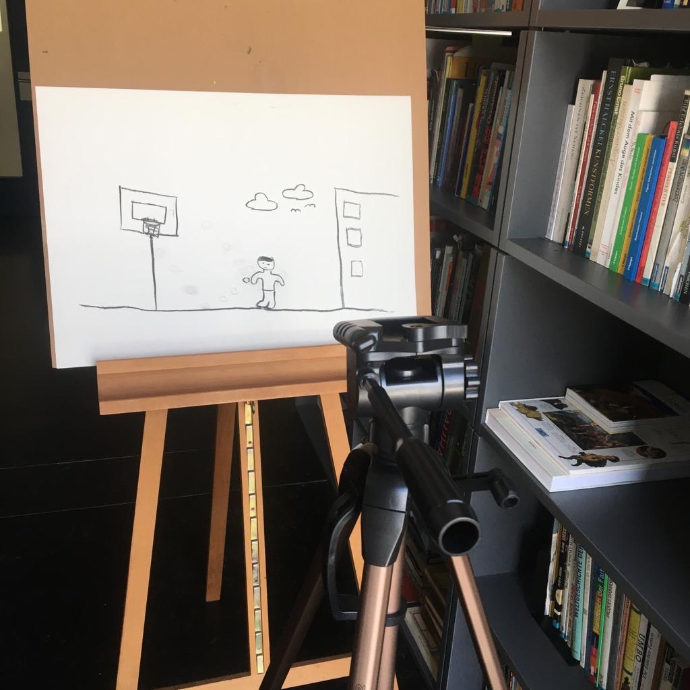

+++
title = "Animation aus einzelnen Bilder"
date = "2022-05-10"
draft = false
pinned = false
+++
Im Fach hatte ich die Möglichkeit ein selbstständiges Projekt zu gestalten und zu dokumentieren. Da William Kentridge mein Idol ist kommt es gerade gelegen. Der hochangesehene Künstler aus Südafrika ist nicht nur irgendein normaler 0815 Künstler sondern er ist bildender Künstler, Filmemacher und auch Regisseur.

Durch gründliches auseinandersetzten einer Idee bin ich auf den genialen Gedanken gekommen, dass ich ein Junge zeichne, welcher gerade einen Basketball wirft. 

Mein erster Entwurf:

Nach langem ausprobieren der Zeichnung bin ich schlussendlich auf eine Skizze gekommen, die mir sehr gefallen hatte. Nachdem holte ich einen Stativ und ein Atelierstaffelei. Ich war bereit für mein Projekt! Nach mehreren Wochen und Versuchen bekam ich das Resultat, welches ich wollte.

Das Schlussprodukt ist, wie ich finde ein Meisterleistung. 

Der Link zum Video:

[High Quality Animation inspired by wilhelm kentridge (Selfmade) - YouTube](https://www.youtube.com/watch?v=bTqVqmTWeaw)